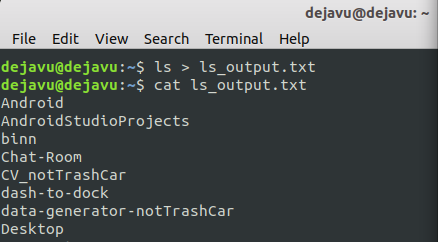
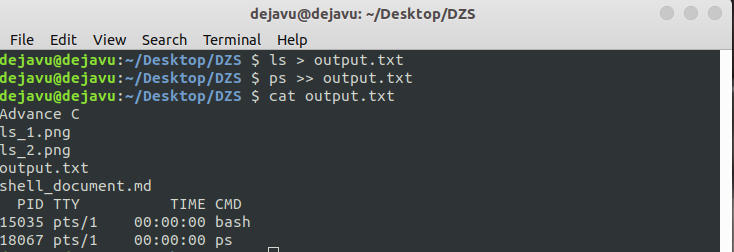
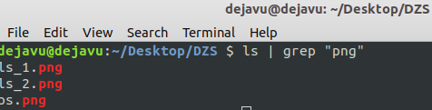
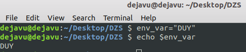
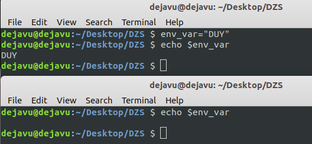
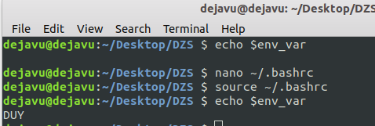

# **SHELL SCRIPTS DOCUMENTATION**

_Writer: Nguyen Duc Duy - Linux Embedded Trainee at DASAN ZHONE SOLUTIONS_

This document is about some advanced knowledge in Shell Script (Bash), including:
1. Redirection
2. Pipes
3. Filters
4. Processing in background
5. Regular Expression
6. Environment Variables

## **Redirection**

### **What is Redirection?**
>**Redirection can be defined as changing the way from where commands read input to where commands sends output. You can redirect input and output of a command.**

### **Standard streams in I/O Redirection**
* _standard input (stdin)_ : The bash shell takes input from stdin. By default, keyboard is used as input.
* _standard output (stdout)_ : The bash shell sends output to stdout. Output goes to display.

### **Redirection into a File**
>**Each stream uses redirection commands. Single bracket '>' or double bracket '>>' can be used to redirect standard output. If the target file doesn't exist, a new file with the same name will be created.**

#### **Overwrite**
Commands with a single bracket '>' overwrite existing file content.
* \>: standard output
* <: standard input

_Syntax:_

`$ <linux command> > <file name>`

_Example:_

`$ ls > ls_output.txt`

#### **Append**

Commands with a double bracket '>>' do not overwrite the existing file content.
* \>>: standard output
* <<: standard input

_Syntax:_

`$ <linux command> >> <file name>`

_Example:_

`$ ps aux > ls_output.txt`

## **Pipes**

### **What is the Pipe?**

>**pipe command lets you sends the output of one command to another. Piping, as the term suggests, can redirect the standard output, input, or error of one process to another for further processing.** 

_Syntax:_

`$ <command 1> | <command 2> | <command n>`

_Example:_

1. Output of 'ls' command is given as input  to 'grep' command. The grep filter searches a file for a particular pattern of characters, and displays all lines that contain that pattern. 

    `$ ls | grep "png"`

    

## **Filters**

### **What is the Filters?**

>**Filters are programs that take plain text(either stored in a file or produced by another program) as standard input, transforms it into a meaningful format, and then returns it as standard output. Some of the most commonly used filters are explained below.** 

1. **cat**

   Displays the text of the file line by line.

   _Syntax:_

   `$ cat <path>`

2. **head**

    Displays the first n lines of the specified text files. If the number of lines is not specified then by default prints first 10 lines.

    _Syntax:_

    `$ head <number_of_lines_to_print> <path>`

3. **sort**

     Sorts the lines alphabetically by default but there are many options available to modify the sorting mechanism. Be sure to check out the man page to see everything it can do.

    _Syntax:_

    `$ sort <-options> <path>`

## **Processing in background**

### **What is processing in background?**

>**If you have a long-running task, it’s not always wise to wait for it to finish. I mean why keep the terminal occupied for a particular command? In Linux, you can send a command or process to background so that the command would be running but the terminal will be free for you to run other commands.**

#### **Start a Linux process in background directly**

_Syntax:_

`$ <command>&`

#### **Send a running Linux process to background**

If you already ran a program and then realized that you should have run it in background, don’t worry. You can send a running process to background as well.
What you have to do here is to use Ctrl+Z to suspend the running process and then use ‘bg‘ (short for background) to send the process in background. The suspended process will now run in background.

#### **See all processes running in background**

_Syntax:_

`$ jobs`

## **Regular Expression**

### **What is Regular Expression?**

>**A regular expression or regex is a pattern that describes a set of strings. Regular expressions are constructed analogously to arithmetic expressions by using various operators to combine smaller expressions.**

There are some special characters that are known as MetaCharacters. They help us in creating more complex regex search term. Mentioned below is the list of basic metacharacters: 

| metacharacters | meaning |
|----------------|---------|
| . or Dot       | will match any character|
| [ ]            | will match a range of characters|
| [^ ]           | will match all character except for the one mentioned in braces
| *              | will match zero or more of the preceding items|
| +              | will match one or more of the preceding items|
|?               | will match zero or one of the preceding items|
| {n}            | will match ‘n’ numbers of preceding items|
| {n,}           | will match ‘n’ number of or more of preceding items|
| {n, m}         | will match between ‘n’ & ‘m’ number of items|
|{, m}           | will match less than or equal to m number of items|

## **Bash Environment Variables**

### **What is Environment Variables?**
>**Whenever we talk to a remote server or do anything on a shell, the shell stores data in form of variables which it stores in an area which is called the environment. The shell environment can be defined as a storage area which the shell compiles every time a new session for a shell is started. This is done so that the environment contains any local or global variables we’ve defined since its last start. We will learn about what local and global variables are in the coming section.**

### **Types of Environment Variables?**
1. **Global Variables**: which are defined as an environment variables are available in all shell sessions which shell compiles

2. **Local Variables**: only available in the currently executing shell and they will be lost once the shell session is closed.

### **Creating Variables**

Both local and global variables are case sensitive and usually capitalised. According to a convention, local variables should be kept lowercase and global variables should be kept uppercase. A variable name cannot start with a number and should only contain characters in the beginning.

_Syntax:_

`$ export <VAR_NAME>=<value>`

_Example:_

`$ env_var="DUY"`

`$ echo $env_var`

**Note:  the variable we defined in above shell is a local variable and this variable will be deleted as soon as we restart the shell.**

### **Exporting Variables**

To convert a local variable we defined above into a global variable, we can export the variable by adding it to the .bashrc file so that is available even across shell restarts. Edit the .bashrc file. 

`$ nano ~/bashrc`

We will now edit the file and add the following content at the end:

`export env_var="DUY"`

Once the content is added, save and quit the file. If we now try to print the variable, it will still not exist. This is because we need to reload the file into the memory with the following command:

`$ source ~/.bashrc`

    

